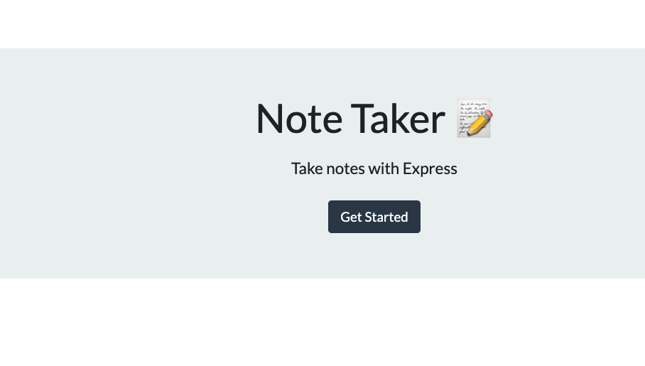
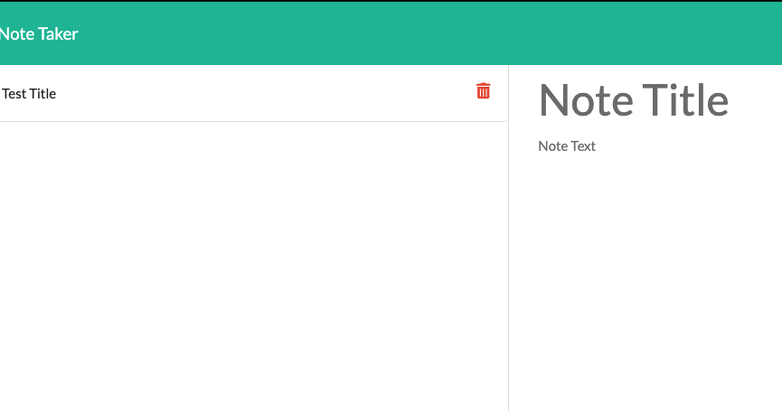
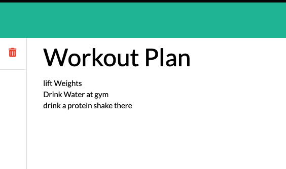

# Note-Taker

## Description

>There are a lot of times that you tend to forget about certain things you had set out for the day. Thats why I made an application called __Note Taker__ which takes your __notes__ and allows you to store them for later use, you also have the ability to delete the note once its no longer of importance to you.

## Technologies Used
>Html |
>Css |
>JavaScript |
> Node.js |
>Express.js |
## Link to Application
[Note-Taker](https://young-lake-20601.herokuapp.com/)


## Video of Application
```bash
A video walkthrough to give you an idea on how this application works.
```

>[Note-Taker](https://www.youtube.com/watch?v=x6lxjz0akwI&ab_channel=YasinElhilo)


## Images of Application 








## Contact Information

```
Feel free to contact me
```
 >
  Email | elhiloyasin@gmail.com|
  ------------------------------ 
  github | https://github.com/elhiloyasin
  ------------------------------ 


